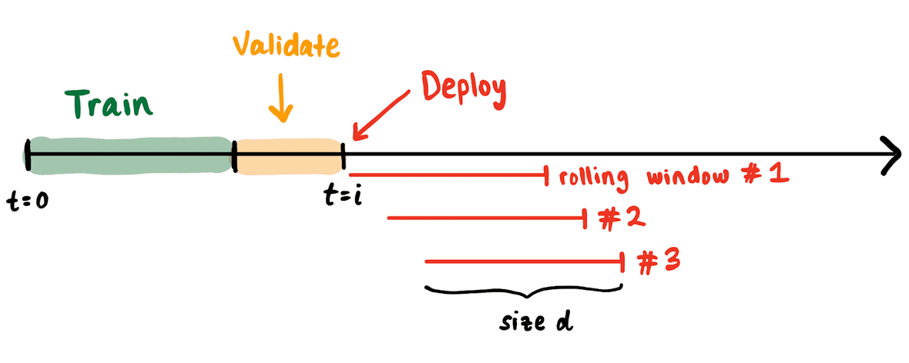

# 现代机器学习监控的混乱局面：重新思考流媒体评估（1/4）
- 作者：Shreya Shankar
- - 原文连接：[rethinking ml monitoring 1](https://www.shreya-shankar.com/rethinking-ml-monitoring-1/)
---
- 我对MLOps感兴趣的部分原因是有太多的工具，而且我无法相信一些受人尊敬的软件老手和学者正在向左、向右、向中间推出新的创业公司。在我之前的公司，使用现有的DevOps工具来简化ML的部署和生产，让我走得很远--但还不够远，促使我思考MLOps问题的定制解决方案，比如ML监控。
- 我喜欢当博士生，因为我可以思考问题，而没有人嚷嚷着要我建立什么。事实是，当涉及到监测ML时，我不知道到底应该建立什么。ML监控的现状是，不加掩饰，一团糟。在这个由四篇文章组成的文集中，我说明了我对获得一个好的开源ML监控解决方案的想法，其大纲如下：
1. 重新思考流媒体机器学习的评估(本篇)
2. 对部署后的各种问题进行分类
3. 调查现有的DevOps工具（如Prometheus）在机器学习监控方面的不足之处
4. 建立一个通用的机器学习监测解决方案的具体研究挑战

## 重新思考流媒体ML的评估
- 在我讨论什么是监控之前，我将把监控定义为：跟踪指标以确定应用程序何时失败。有很多文章都在说服你，监控对于机器学习应用是必要的。下面是我对为什么我们需要监控的两点看法：

1. 生产中的应用程序将不可避免地遇到问题。我们希望尽早发现并解决这些问题，以尽量减少停机时间。
2. 机器学习越来越多地被部署在高风险的场景中（例如，累犯、贷款、信用卡欺诈、招聘、自动驾驶汽车），其中的监管是不可避免的。

- 许多文章还讨论了在生产型ML系统中会出现哪些类型的错误，促使人们去监测什么。我个人对所有可能发生的bug以及必须执行和监控的大量测试和指标清单感到不知所措，以确保管道的 "良好 "健康。在我以前的工作中，我曾经有过一次生存危机，因为我不知道为什么要监控成千上万的东西；我只是认为这是管道 "不失败 "的必要条件。但 "失败 "是什么意思，特别是在ML背景下？

## 为什么造成这样的局面？
- 机器学习领域有一个有趣的评估历史。针对ML的指标被设计用来评估一个特定模型在特定数据集上的表现。为了在 "学术 "环境中评估一个模型，几十年来，我们一直在测量固定的指标，如准确率、精确率和召回率，这些指标是我们的模型在训练期间没有看到的 "验证 "集。为了评估一个模型是否能推广到新的数据，机器学习入门课程强调了检查过拟合的重要性（即验证集指标应该接近训练集指标）。这真的是我们宣称可推广性所需要的全部吗？
- 在今天这个基准的黄金时代，我们并没有真正质疑这种在一些静态或固定的数据集上计算指标的评估程序（有一些例外）。最近，我的朋友Deb和其他ML领导人一直在提高人们对当前通用的ML评估方法在评估ML系统中与关键子群体（如种族）和外部性（如能源消耗）相关的失败模式方面的认识。我提到这项工作是因为我认为它非常重要，尽管与我在这里要谈的内容正交。
- 我们很清楚，在实践中，虽然所有的模型都是错误的，但有些模型是有用的。在 "行业 "背景下的ML评估，毫不奇怪，可以追溯到50年代和60年代的军事背景下。ROC曲线是在第二次世界大战期间发明的，用于对战场上的敌方物体进行分类，我想主要是因为从业者需要计算有用的模型，并随着时间的推移抛弃无用的模型。我喜欢把ROC曲线和PR曲线看作是更好的指标 "聚合"，它有助于告知模型输出的哪个阈值，以及这种阈值如何随时间变化。当在实践中（例如医疗）长期部署ML时，这种聚合显然是必要的。
- 因为在实践中，我们与数据流打交道，而不是固定的数据集，ML监测的行业标准（可能是软件监测的结果）遵循这些步骤：

1. 选择他们认为代表模型性能的指标和阈值
2. 选择一个滑动窗口大小（单位是基于时间的，如天或周）来计算指标。
3. 当指标值下降到阈值以下时，设置警报。
4. 警报后，手动或自动触发重新训练

- 这个过程假设故障被定义为指标值下降到其阈值以下。为什么我们需要把这个定义弄正确呢？在你不需要的时候触发重新训练的影响可能是不好的：它可能会浪费计算，或者如果最近的窗口不能代表未来的数据，它实际上可能会降低性能。在需要的时候不触发重新训练的影响是，你的性能将继续恶化--甚至可能无声无息。因此，我们希望我们的警报是健全的（即，没有错误的警报）和完整的（即，每次出现故障时都触发）。不幸的是，我总是得到太多或者太少的警报，促使我质疑--我们的评估程序有什么问题？

## 我们目前的做法有什么问题？
- 现在我将论证为什么这种在数据流上评估ML的程序被打破了。假设我们有一个从时间t=0开始的数据流。我们在t=0和t=i之间的数据上训练和验证一个模型。我们在t=i处 "部署"，并连续计算跨越d天的滚动窗口的ML指标。
- 
- 有一些自然和常见的现象会被计入公制计算中：

    - **代表性差异**。各个窗口的类比可能不一样（例如，一个窗口的阳性比例可能与另一个窗口的阳性比例有很大不同）。
    - **不同的样本大小**。每个窗口中的数据点数量可能不同（例如，周日收到的请求数量少于周一收到的请求数量）。
    - **延迟的反馈**。由于合理的事件（如失去互联网连接），标签可能会滞后出现，使得没有标签的预测不可能被纳入当前窗口的评估指标。

- 在每一种情况下，即使你测量auROC和auPRC这样的聚合，指标值也会发生剧烈变化--而模型与预期任务的 "一致性"（即预测能力）或 "概念漂移 "没有任何变化。当我们触发重新训练时，我们隐含地相信我们的模型不具有我们预期的预测能力。如果我们的滚动窗口与我们的保留验证集的假设不一致（例如，我们的滚动窗口跨度为一周，而我们的验证集跨度为一个月），我们怎么能对这个信念有信心？大多数时候，我们并没有明确意识到在训练时所作的所有假设。**我认为在一个滚动窗口上评估的ML特定指标告诉你的是模型的一致性，而不是该窗口中数据的属性。**
- 因此，由于我们不知道如何评价模型与预期任务的一致性，对数据流的评价在不同的组织中是不同的。我们不知道在哪里为可接受的业务绩效划线，所以我们看所有可辩护的指标（例如auROC），并试图为它们的一些聚合进行优化。虽然我们没有更好的选择（据我所知），但这显然是破绽百出的，并使ML在如此多的产品设置中变得毫无用处。许多行业的ML资深人士谈到，我们需要从ML指标到商业结果的清晰明确的映射--成熟的组织有一个ML模型的 "SLO "概念，其中BizDev和数据人员合作，以确定单一任务（SLO）的指标集合、窗口大小和警报程序。当SLO与任务不一致时，你不知道一个指标的下降是否应该触发一个重新训练！这种合作来计算SLO参数！这种计算SLO参数的合作迫使人们定义如何对模型输出采取行动。疯狂的是，可能需要几个月甚至一年的时间来确定正确的参数来计算SLO。更重要的是，与我的兴趣更相关的是---**这样一个针对特定环境的ML SLO选择程序与建立一个通用工具来监控ML管道是不一致的。**

## 回顾总结
- 因此，在我所概述的流媒体ML评估中确实有两个不同的问题：

  1. 要使目前的 "行业标准 "评估程序（选择指标、阈值和窗口大小）发挥作用需要时间和许多资源
  2. 这个程序可能永远不会成功，这取决于数据的性质，而且通用性很差（即，需要同样多的时间和资源来解决新任务的评估协议或SLO）--使得ML在生产中真的很难实现

- 我猜想，与ML相关的敏捷宣言的延伸以及围绕ML的优点和缺点的更好的教育可以解决第一个问题。第二个问题对我来说似乎更难解决--作为一个ML信息员，我对规定具体的SLO不感兴趣；我感兴趣的是建立基础设施，让任何人都能轻松监控他们关心的ML SLO。
- **我希望我们的ML社区能更深入地思考如何普遍评估将在数据流上运行的模型的一致性或预测能力。** 也许我们不能比我们已经有的程序做得更好，但我很好奇--我们能不能建立技术来理解ML结果的特定数据的时间性，并使用这些信息来为我们选择SLO？我们能不能建立更多的一般性指标，明确地与业务成果挂钩，如 "ML Apdex Score"？这些一般的指标能否对我上面概述的所有三种现象--代表性差异、不同的样本量和延迟反馈--保持稳健？我不知道这最终会是什么样子，但我相当有信心，能够阐明和衡量正确的SLO将为从生产性ML应用中获得价值提供巨大的突破。我很高兴我们能取得进展。
- 感谢Alex Tamkin、Rolando Garcia和Peter Schafhalter对许多草案的反馈。
  
---
## 声明
1. 没有任何MLOps公司付钱给我写这个。我无法对隐藏在付费墙之外的解决方案发表明智的看法，所以我对现有的专有工具不做任何声明。另外，我认为完全开源的ML监控解决方案是有市场的。
2. 对我来说，最有用的MLOps资源来自博客文章、Slack频道和口碑，这很疯狂。这个领域完全处于起步阶段。
