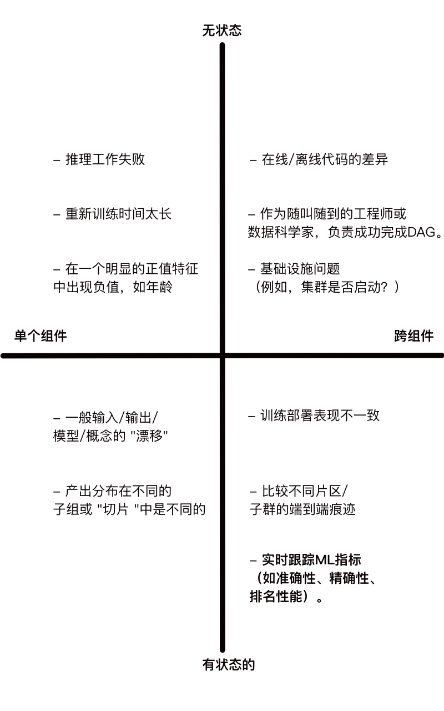

# 现代机器学习监控的混乱局面：重新思考流媒体评估（2/4）
- 作者：Shreya Shankar
- 原文连接：[rethinking ml monitoring 2](https://www.shreya-shankar.com/rethinking-ml-monitoring-2/)
---
- 在《现代ML监控乱象》系列的最后一篇文章中，我讨论了现有流式ML指标失败的一些方式。在这篇文章中，我从 "以数据为中心 "的角度过渡到软件工程的角度：我调查了现有的部署后问题，并将其分类，以激励更好的开源ML监控工具。
  
## 作为ML从业者，我们如何分配我们的时间？
- 最近，Zillow因其最新的ML灾难而在社交媒体上引起热议。一些人声称他们的ML购房和售房项目因低质量的预测而关闭。另一些人则认为，关闭的原因是没有关于如何对预测采取行动的组织程序--员工手动推翻了预测，以满足他们自己的配额。谁知道问题是什么，但我认为Zillow的新闻变得非常流行的一个重要原因是**我们所做的许多ML应用在生产中都是不稳定的。** 我们不知道他们是否或何时会失败。我们不知道，在组织上，如何对模型输出采取行动。而且我们肯定不知道当我们怀疑ML管道或管理方面出现一些故障时该怎么做。
- 为了剖析如何改善应用ML的令人苦恼的状态，我认为了解ML从业者目前如何分配他们的时间很重要。经过广泛的搜索，我在一篇关于87%的机器学习项目失败的文章中发现了一个相当准确的细分（在我看来），即行业ML项目是如何分配时间的：
- 
- 图1：分解ML项目时间分配的图表，取自iiot-world。
- 图1显然解释了为什么数据标签初创公司目前在MLOps市场上获胜，但我更感兴趣的是，随着越来越少的ML项目失败，细分市场将如何变化。就像在软件方面一样，我怀疑在未来5年内，图表中的大部分大众都会在运营化方面。**我们如何从数据化中去除质量，并将更多的质量放在监测上？**

## 构建一个ML管道
- 上图所示的分类对于失败的ML项目来说感觉很准确。在我以前的ML工作的任期结束时，我们最终遵循这个过程来建立新的成功的ML管道：

    1. 想出针对ML的服务水平目标（SLO），比如在每月的窗口中90%的召回率 🪟
    2. 编写为占位的ML管道输出计算SLO的函数（例如，基线预测概率） 🪠
    3. 编写确认校准输出的函数 ⚖️
    4. 编写管道的所有组件或阶段，除了模型训练/评估之外 🔧
    5. 进行仔细的探索性数据分析，编写清理数据、选择特征等的管道组件 📊
    6. 将上述所有内容生产化 🚧
    7. 训练/评估逻辑回归模型或决策树 🌲
    8. 逐步改善模型 📈

- 这里的关键是，**在管道的一些骨干部分投入生产之前，我们没有做任何建模工作**、消除了花在数据预处理上的时间，这可能是特定的训练/测试分割。然而，在我上面描述的范式中，我们在管道中的数据处理组件中仍然有bug（我认为这是不可避免的）。当采用这种模式时，我注意到我的大部分开发人员的时间从 "研发 "建模工作转移到监控生产ML服务。
- 几个月来，我一直记录着我个人在监控时面临的部署后问题。缺少数据导致空值键的连接，子组表示法随时间变化，将错误的模型推广到生产中，上游依赖关系（如嵌入）变化，Spark节点故障......这个清单似乎没有尽头。每当我面临一个新问题时，我都试图设计一个警报，以防止未来出现这种故障模式。**随后，管道代码逐渐变得不可持续，而我在生产中仍然面临着许多新的挑战--促使我思考更清洁的部署后问题的分解。**

## 部署后问题的分类
- 假设一个团队为一项任务定义了一个具体的ML SLO，比如在每月的窗口中90%的召回。重新表述我关于部署后问题的问题--这些SLO没有达到的原因有哪些？我喜欢Neptune.ai博客文章中的这个表格：

|   | 生产挑战 |关键问题 |
| ------------- | ------------- |------------- |
| 1  | 数据分布变化  |为什么我的特征值会有突然的变化？  |
| 2  | 生产中的模型所有权  |谁拥有生产中的模型？DevOps团队？工程师？数据科学家？  |
| 3  | 训练-部署不一致  | 尽管我们在开发过程中进行了严格的测试和验证尝试，但为什么该模型在生产中给出的结果不佳？  |
| 4  | 模型/概念漂移  | 为什么我的模型在生产中表现良好，而随着时间的推移，性能突然下降？  |
| 5  | 黑匣子模型  | 我如何根据商业目标并向相关的利益相关者解释和说明我的模型的预测？  |
| 6  |  一致的对手 | 我怎样才能确保我的模型的安全？我的模型被攻击了吗？  |
| 7  | 模型准备情况  | 我如何将我的模型的较新版本的结果与正在生产的版本进行比较？  |
| 8  | 管道健康问题  | 为什么我的训练管道在执行时失败？为什么再培训工作需要这么长时间才能运行？  |
| 9  | 表现不佳的系统  | 为什么我的预测服务的延迟非常高？为什么我的不同模型的延迟有很大的不同？  |
| 10  | 极端事件的案例（异常值）  | 我将如何在极端和非计划的情况下跟踪我的模型的效果和性能？  |
| 11  | 数据质量问题  | 我怎样才能确保生产数据的处理方式与训练数据的处理方式相同？  |

- 图2：部署后问题表，取自Neptune.ai。
- 说实话，很多博客文章读起来就像洗衣清单。作为一个懒人，我绝不会在每个拉动请求上手动检查每个清单项目。**我们如何使这些挑战更容易推理，以便我们能够建立一个监测工具？** 戴上我的软件工程帽子，我发现将这些生产挑战（以及其他挑战）提炼成四种类型的问题是很有帮助的，这些问题沿着两个轴线（状态和组件）分组：
- 
- 图3：将少数部署后的问题按状态和组件轴进行分类。
- 让我定义一下 "状态 "和 "组件"，以便图3真正有意义。很多时候，只有当你将数据点与历史上的一组数据点进行比较时，你才知道ML系统中存在一个错误。例如，也许代表传感器数据的表格中的一列主要是空值。是传感器刚刚坏了，还是它一直都在坏？为了回答这样的问题，你需要跟踪历史数据，或状态。此外，你可能需要来自多个不同组件的信息来诊断一个ML系统的故障模式。例如，假设模型训练的数据和模型推断预测的实时数据之间存在差异。显然，一个调试器应该关心ML管道的训练和推理部分。我把这种错误定义为跨组件的错误。
- 对我来说，理解这些轴线，就可以知道为什么ML监控从根本上说比传统的软件监控更难，也更有区别。软件SLI完全属于单组件区域，如平均响应延迟。最复杂的软件SLI是有状态的和单组件的，促使了像Prometheus这样的工具。**但最基本的ML SLI，如准确度，是有状态的和跨组件的--最难处理的桶。** 一旦你能够有效地监控这种有状态的跨组件指标（如实时准确性），以确定何时有bug，了解有状态的单组件指标，如第90个百分点的特征值，是很有用的，因为你就可以确定bug在你的管道中的位置。

## 通过状态-组件视角查看现有的工具
- 我个人对一个完全开源的监控解决方案很感兴趣，它可以有效地、快速地、以一种需要用户付出最小努力的方式来跟踪可能属于这4组中任何一组的指标。现有的工具能做到这一点吗？从我的研究中，我发现开源监控工具只涉及4个组的一个子集。我在头脑中把现有的工具分为以下几个 "层次"：
    1. 缠绕着的报告 scipy.your_favorite_statistical_test(finite_sample_from_dist_A_that_you_define, finite_sample_from_dist_B_that_you_define) —用户被迫跟踪状态和组件。在这里，用户需要解决数据管理问题，即为他们关心的每个组件存储历史输入和输出，编写作业来反复对感兴趣的数据进行子采样并创建这些报告，并在这个过程中组织所有工件。
    2. 工作流协调工具（如Airflow、Argo、Kubeflow）--用户被迫跟踪状态。在这里，仪表盘会向你显示单个管道运行中不同任务或组件的详细结果。但用户无法真正访问当前运行中的历史运行值。
    3. Postgres数据库持有单个组件的历史输入和输出，以及一个显示np.some_aggregation(dist_A)随时间变化的仪表板--用户被迫跟踪组件。在这里，用户需要知道要监控哪些组件，手动连接组件的输入和输出以进行任何自定义的聚合（例如，F1分数），并定义他们自己的标准，即如何以及何时对仪表盘的结果采取行动。例如，如果一个特征的平均值变化了10%，用户会怎么做？
    4. 专有的供应商，鉴于对你的数据和模型的访问，为你监控一切。不知道这些公司是做什么的，所以我不作评论。

## 回顾总结
- 在这篇文章中，我讨论了如何通过两个简单的轴对部署后问题进行分类：状态和组件。我不想讨论如何监测我在图3中描述的每个问题，但回到我在本期第一篇文章中提出的一个问题--要如何扩展现有工具以支持有状态的组件和跨组件的情况？是否有可能轻松地扩展它们？在下一篇文章中，我将探讨如何调整Prometheus以监测ML，并研究它的缺陷所在。
- 感谢Laszlo Sragner对早期草案的反馈。

---
## 声明
1. 我喜欢数据科学博客文章中点击率高的标题。🙃
2. 这并不是要挖苦博文作者；而是要说明生产ML问题的广泛性。
3. 这并不明显，为什么像准确性这样的实时指标的近似是一个有状态的和跨组件的程序。这是有状态的，因为你需要一组历史预测和标签来计算这个指标。这是跨组件的，因为在许多情况下，提供预测的组件与收集反馈（标签）的组件不同。