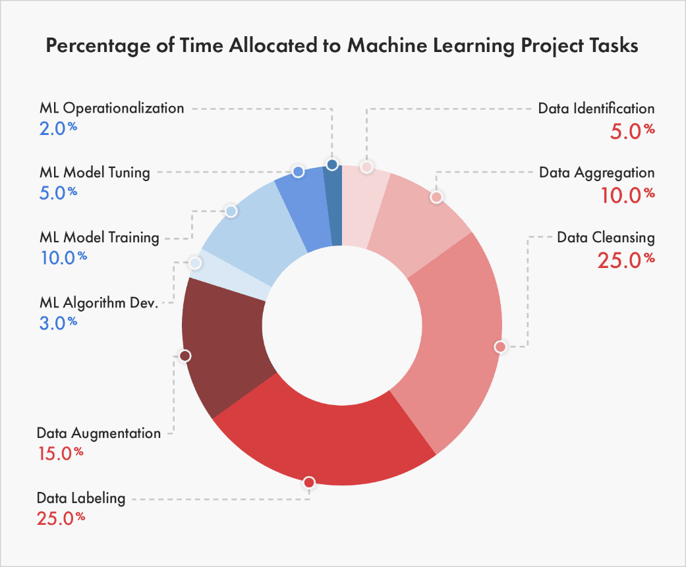

# 现代机器学习监控的混乱局面：重新思考流媒体评估（2/4）
- 作者：Shreya Shankar
- 原文连接：[rethinking ml monitoring 2](https://www.shreya-shankar.com/rethinking-ml-monitoring-2/)
---
- 在《现代ML监控乱象》系列的最后一篇文章中，我讨论了现有流式ML指标失败的一些方式。在这篇文章中，我从 "以数据为中心 "的角度过渡到软件工程的角度：我调查了现有的部署后问题，并将其分类，以激励更好的开源ML监控工具。
  
## 作为ML从业者，我们如何分配我们的时间？
- 最近，Zillow因其最新的ML灾难而在社交媒体上引起热议。一些人声称他们的ML购房和售房项目因低质量的预测而关闭。另一些人则认为，关闭的原因是没有关于如何对预测采取行动的组织程序--员工手动推翻了预测，以满足他们自己的配额。谁知道问题是什么，但我认为Zillow的新闻变得非常流行的一个重要原因是**我们所做的许多ML应用在生产中都是不稳定的。** 我们不知道他们是否或何时会失败。我们不知道，在组织上，如何对模型输出采取行动。而且我们肯定不知道当我们怀疑ML管道或管理方面出现一些故障时该怎么做。
- 为了剖析如何改善应用ML的令人苦恼的状态，我认为了解ML从业者目前如何分配他们的时间很重要。经过广泛的搜索，我在一篇关于87%的机器学习项目失败的文章中发现了一个相当准确的细分（在我看来），即行业ML项目是如何分配时间的：
- 
- 图1：分解ML项目时间分配的图表，取自iiot-world。
- 图1显然解释了为什么数据标签初创公司目前在MLOps市场上获胜，但我更感兴趣的是，随着越来越少的ML项目失败，细分市场将如何变化。就像在软件方面一样，我怀疑在未来5年内，图表中的大部分大众都会在运营化方面。**我们如何从数据化中去除质量，并将更多的质量放在监测上？**

## 构建一个ML管道
- 上图所示的分类对于失败的ML项目来说感觉很准确。在我以前的ML工作的任期结束时，我们最终遵循这个过程来建立新的成功的ML管道：

    1. 想出针对ML的服务水平目标（SLO），比如在每月的窗口中90%的召回率 🪟
    2. 编写为占位的ML管道输出计算SLO的函数（例如，基线预测概率） 🪠
    3. 编写确认校准输出的函数 ⚖️
    4. 编写管道的所有组件或阶段，除了模型训练/评估之外 🔧
    5. 进行仔细的探索性数据分析，编写清理数据、选择特征等的管道组件 📊
    6. 将上述所有内容生产化 🚧
    7. 训练/评估逻辑回归模型或决策树 🌲
    8. 逐步改善模型 📈

- 这里的关键是，**在管道的一些骨干部分投入生产之前，我们没有做任何建模工作**、消除了花在数据预处理上的时间，这可能是特定的训练/测试分割。然而，在我上面描述的范式中，我们在管道中的数据处理组件中仍然有bug（我认为这是不可避免的）。当采用这种模式时，我注意到我的大部分开发人员的时间从 "研发 "建模工作转移到监控生产ML服务。
- 几个月来，我一直记录着我个人在监控时面临的部署后问题。缺少数据导致空值键的连接，子组表示法随时间变化，将错误的模型推广到生产中，上游依赖关系（如嵌入）变化，Spark节点故障......这个清单似乎没有尽头。每当我面临一个新问题时，我都试图设计一个警报，以防止未来出现这种故障模式。**随后，管道代码逐渐变得不可持续，而我在生产中仍然面临着许多新的挑战--促使我思考更清洁的部署后问题的分解。**

## 部署后问题的分类
- 假设一个团队为一项任务定义了一个具体的ML SLO，比如在每月的窗口中90%的召回。重新表述我关于部署后问题的问题--这些SLO没有达到的原因有哪些？我喜欢Neptune.ai博客文章中的这个表格：
| First Header  | Second Header |
| ------------- | ------------- |
| Content Cell  | Content Cell  |
| Content Cell  | Content Cell  |