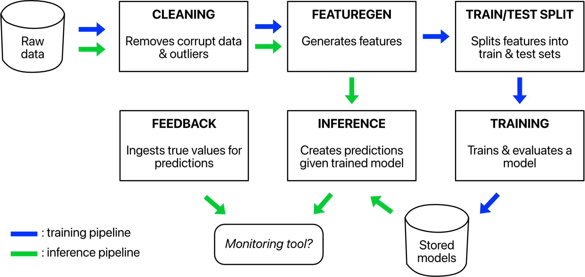
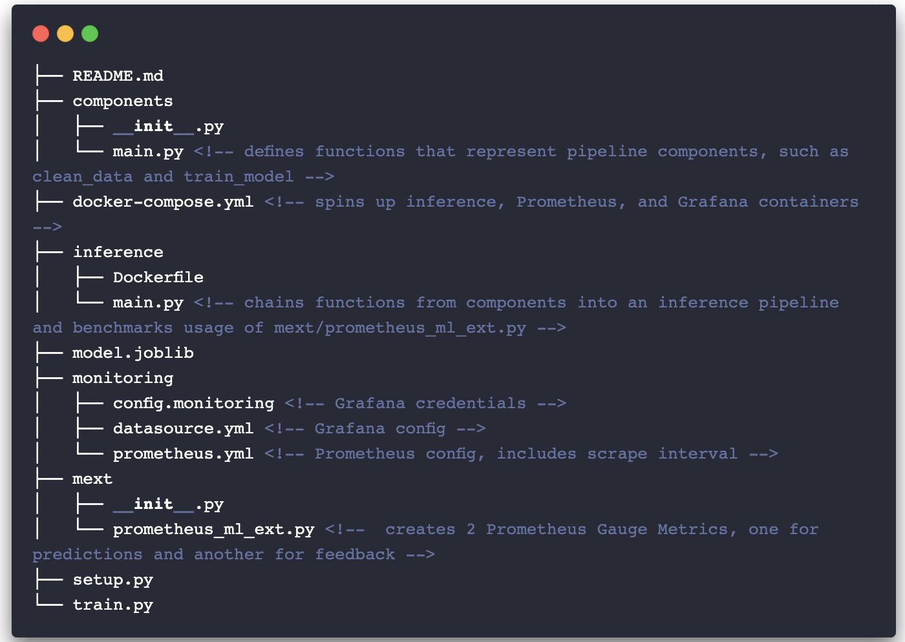
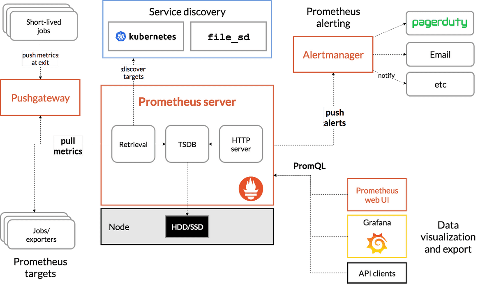
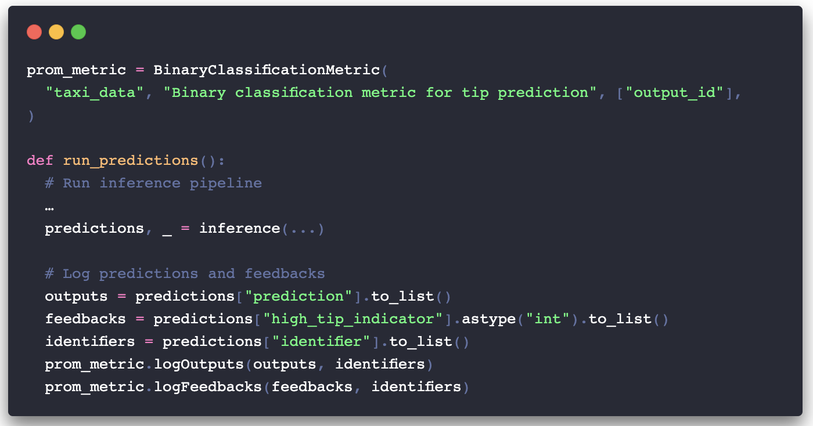
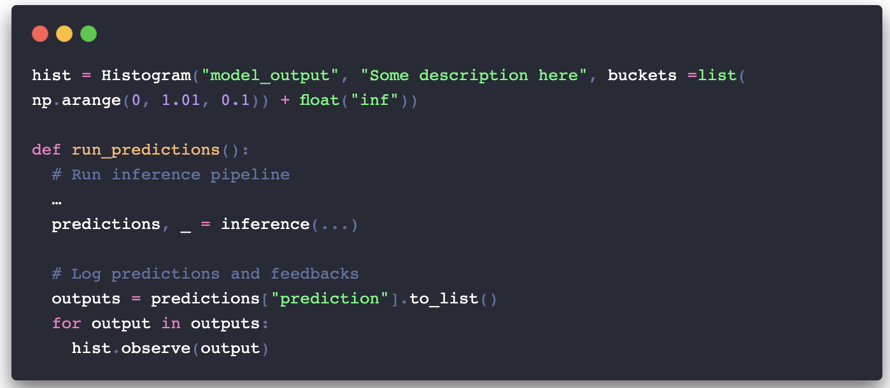
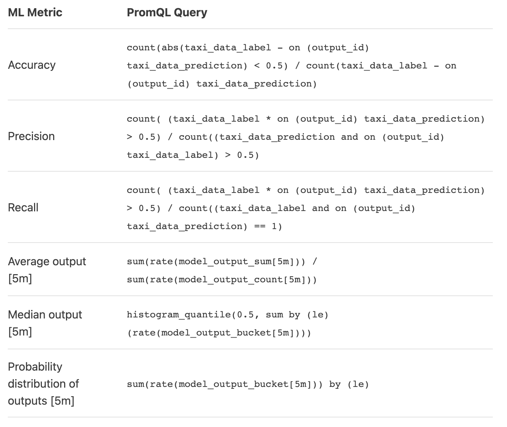
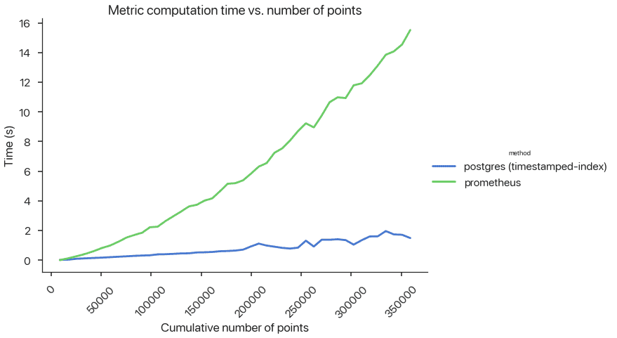

# 现代机器学习监控的混乱局面：重新思考流媒体评估（3/4）
- 作者：Shreya Shankar
- 原文连接：[rethinking ml monitoring 3](https://www.shreya-shankar.com/rethinking-ml-monitoring-3/)
---
- 在上一篇文章中，我调查了现有的部署后问题，并将它们分为两个轴：状态和组件。我提到，监控跨组件的状态指标，如模型的准确性，对于维护ML管道至关重要，但在现有的工具中却很困难。在这篇文章中，我们将亲身体验这些困难：我们将用Prometheus（一种流行的软件监控工具）扩展一个玩具ML管道，以提供ML监控。在这个过程中，我们将看到Prometheus的许多不足之处，从代码混乱到算法的低效率

## 背景介绍
- 有一天在工作中，当我在Slack频道中浏览AWS警报的时候，我突然意识到我的infra同事和我对 "标签 "一词的解释非常不同。他指的是一个标识符。我是指预测的真实值。我们只是在一个大项目进行了几个月后才发现我们是错位的。值得庆幸的是，我们从未在同一个任务上合作过，所以对我们没有任何影响。但我想知道这种错位是否会在其他组织中造成问题。
- 我认为关于ML监测的讨论中最令人困惑的方面是术语。像 "度量 "和 "标签 "这样的术语是超载的。在这篇文章中，我将利用以下定义：
  - 指标：一个汇总数据的函数，以评估管道的性能如何（例如，平均值、准确度）。
  - 普罗米修斯公制：数字测量的时间序列
  - 标识符：分配给一个对象或对象集合的唯一名称
  - 预测：由一个ML模型做出的输出
  - 反馈：预测的 "真实 "值
  - 服务水平指标（SLI）：一个汇总预测和反馈的函数，以评估管道的性能如何（例如，准确性）

## ML任务，数据源，和管道
- 在这个练习中，我使用纽约市出租车联盟的数据构建了一个ML管道来预测出租车乘客是否会给司机高额小费（二元分类）。使用Prometheus，我们将监测**累积的准确性**，或者说自部署以来所有预测的准确性。训练和推理管道在架构上共享一些组件，看起来像这样：
- 
- 图1：ML管道架构。
- 由于这是一个二元分类问题，推理组件产生0和1之间的浮动值预测，而反馈组件返回0或1的值。我把我的管道和实验代码寄存在这个资源库中，结构如下：
- 
- 我在2020年1月的数据上运行训练管道，模拟2020年2月1日开始的部署。我没有进行任何再训练，主要是因为这个练习的目的是展示Prometheus的故障模式，而不是调试由 "数据漂移 "导致的低SLI。

## Prometheus入门
- 普罗米修斯(Prometheus)是一个开源的软件监控工具：
  1. 收集和存储指标，如响应延迟
  2. 允许用户通过一种名为PromQL的查询语言查询公制值的集合（例如平均延迟）。

- 普罗米修斯支持四种类型的度量值：
  - **计数器**：一个单调增长的累积度量。例如，可用于跟踪预测服务的数量。
  - **仪表**：一个代表单一数值的度量，可以任意改变。例如，可以用来跟踪当前的内存使用情况。
  - **直方图**：一个将观察到的数值归类到用户预先定义的桶中的度量衡。这有很高的服务器端成本，因为服务器在查询时要计算量值。
  - **摘要**：在一个滑动的时间窗口中跟踪用户预先定义的量化指标。这具有较低的服务器端成本，因为量值是在登录时配置和跟踪的。另外，摘要指标一般不支持查询中的聚合。

- 通常情况下，企业的DevOps或SRE人员使用Prometheus来监控软件SLO。用户用他们的应用程序代码来记录Metric值。这些值被刮取并存储在Prometheus服务器中。这些值可以使用PromQL进行查询，并导出到Grafana等可视化工具中。该架构看起来像这样：
- 
- 图2：普罗米修斯架构。
- Ivan Velichko的这一系列教育性的帖子很好地解释了普罗米修斯。我将总结他的一些关键点：
  - 普罗米修斯不是一个时间序列数据库（TSDB）。它只是利用了一个TSDB。
  - 由于普罗米修斯定期刮取数值，如果度量值的变化比刮取间隔更频繁，一些度量类型（如仪表）会失去精度。这个问题不适用于单调增长的度量（如计数器）。
  - Metrics可以用任意的标识符来记录，这样在查询时，用户可以通过标识符的值来过滤Metrics。
  - PromQL很灵活--用户可以在不同的窗口大小上计算许多不同的度量值聚集，这些参数可以在查询时指定。

- Velichko承认，PromQL在实际软件应用中的使用 "远非微不足道"（也就是说，令人讨厌）。然而，在学习了矢量匹配和其他语法之后，我认为它并不太糟糕--特别是当我们不需要加入Metrics的时候。PromQL查询通常不会太长，而且在查询时有许多辅助函数可以使用。但我们会看到它对ML监控的情况有多糟糕。

## Prometheus 🤝 ML
- 以下问题将有助于评估Prometheus是否是一个合适的ML监控解决方案：
  1. 我们可以使用Prometheus Metrics来跟踪我们的ML管道中的任何ML指标吗？将 "ML度量 "映射到Prometheus Metric类型并不直接。对于单一组件的有状态指标，也许我们想使用直方图或汇总指标。如果我们对跨组件的有状态度量感兴趣，我们需要考虑如何将不同组件的度量 "连接 "起来，以计算ML SLI，如准确度和精确度。
  2. 用PromQL编写ML SLI有多难？
  3. ML SLI的查询延时是多少？

## 管线仪表
### 跨组件的有状态度量
- 普罗米修斯的指标类型（计数器、测量仪、直方图或摘要）没有一个明显地映射到我们想要测量的SLI：累积精度。相反，我们将使用2个Gauge Metric3--一个用于管道预测，一个用于反馈--并在PromQL中聚合它们来计算准确性。在mext/prometheus_ml_ext.py中，我定义了一个BinaryClassificationMetric类，其中包含Gauge Metrics以及logOutputs和logFeedbacks方法，以便在每次推理调用后更新它们。对应用程序进行仪表化是非常直接的。下面是inference/main.py中的Prometheus专用代码：
- 
- 将累积的准确度表现为两个Gauge Metrics并不完全是直接的，但我仍将这种经验评为简单。

### 单一成分的有状态度量
- ML监控解决方案经常监控输入和输出的聚集，如中位数和p90，以粗略地测量 "数据漂移"。有时，他们还计算更复杂的统计测试（如Kolmogorov-Smirnov测试），我肯定永远无法用PromQL来写。这些方法既不健全也不完整，但为了这个练习的目的，我们可以用直方图度量来跟踪输出值的各种百分位数。下面是inference/main.py中的相关仪表代码：
- 
- 这种整合比跨组件的情况更容易，但一个主要的缺点是，我们需要提前定义我们的直方图桶。这有两个原因：（1）我们常常不知道输出的分布是什么样子的，（2）分布可能随着数据的 "漂移 "而改变。

## 用于ML SLI的PromQL
- 现在我们已经检测了我们的管道，我们可以通过Docker-Compose启动我们的容器，开始使用PromQL刮取记录的Metric值并提取我们的ML指标。使用PromQL结构和一个很大的白板，我想出了以下查询：
- 
- 在ML SLI中使用PromQL有几个问题：
- **不正确性**。当我第一次运行查询的准确性时，我很惊讶，结果并不完全准确（哈哈）。这是因为我的搜刮间隔是15秒，这对于我产生新预测的速度来说太大了。把搜刮间隔缩短到5秒，提高了查询的精确性，但使Prometheus容器的速度变慢，消耗更多的内存和计算资源。

- **滑动窗口的挑战**。即使在几个小时后，我也无法弄清楚如何在固定的窗口大小上计算前3个指标中的任何一个（交叉成分）。我没有发现关于在滑动窗口上计算PromQL中的连接的资源。我不太擅长使用Prometheus，所以请让我知道是否有可能通过窗口计算这些指标。

- **复杂的查询**。表中的最后3个指标（单成分）并不像前3个（跨成分）那样错综复杂。我不会期望任何数据科学家编写这些跨组件的PromQL查询，特别是对于那些简单地调用scikit-learn模块的函数。一个理想的监测工具应该允许用户将自定义的Python函数作为指标传入，并在后端有效地产生这些指标的值。

## 查询延时
- 在本小节中，我将重点讨论延迟问题，特别是跨组件查询的延迟。为了计算类似SLI的准确性，如上一小节所示，我们需要对output_id做一个连接。这是对Prometheus的严重滥用，因为output_id的cardinality显然会随着ML管道的预测数量而增长。**Prometheus并不是为了处理高卡数的标识符，更不用说高卡数的连接了。**
- 为了证明Prometheus的扩展性有多差，我设计了一个小型的Postgres后端，将预测和反馈放在以时间戳为索引的表中。我计算了PromQL和PostgreSQL的准确度，并测量了与管道产生的预测数量有关的延时：
- 
- 图3：ML查询的延迟。
- 由于Prometheus度量值不是急于计算的（也就是说，当用户想在Grafana上查询或绘制一段时间的度量值时，它们都会被计算出来）、**这种延迟是不可接受的，而且不能扩展。** 随着更多预测的产生，许多想要跟踪实时ML SLI的组织可能无法足够快地更新或刷新他们的SLI。也许在某些领域，每天甚至每小时计算一次SLI可能就足够了，但对于数据和用户偏好经常变化的领域来说，这就不适用了。我知道我在使用Prometheus的情况下，它并不是为之设计的，但总的来说，这些问题共同突出了企业的需要：（1）有一个ML监控团队，在Postgres或现有的DBMS之上创建一个层，或者（2）利用一个专门用于ML监控的专有供应商。我相信，现在、**我们需要更好的ML监测实践和工具。**

## 回顾总结
- 在这篇文章中，我强调了使用Prometheus进行ML监控的一些主要隐患，最明显的是：
- 需要使用多个普罗米修斯公制类型进行跨组件监测
- 需要提前定义直方图桶以进行单组件监控
- 查询结果的正确性取决于搜刮时间间隔
- 无法处理滑动窗口
- 看起来很恶心的PromQL查询
- 跨组件指标的高延迟（即高cardinality连接）。

- 在这个系列的下一篇也是最后一篇文章中，我将讨论建立一个通用的ML监控工具的一些关键要求和想法。我非常高兴能与大家分享，同时还有一个监测实时ML SLI的原型。更多的内容将陆续推出，新年快乐!
- 感谢Divyahans Gupta, Preetum Nakkiran, 和Peter Schafhalter对许多草案的反馈。

---
## 声明
1. 这个帖子是针对ML工程师和信息员的。我建议对数据库（如表、连接、索引）、ML SLI（如准确性、精确性、召回率）和查询语言（如SQL、PromQL）有基本认识。
2. 我用大写的Metric来指代Prometheus Metric的抽象概念。
3. 我为预测和反馈选择了Gauge Metric，因为它们表示可以上升或下降的数值。由于反馈和推理组件在ML管道中通常是相互分离的，所以真的没有办法（我能想到的）避免连接。
4. 如果这些查询是错误的，我也不会感到惊讶。如果有错误，请纠正我。
5. 也许这不是一个失败的模式--我只是想不通。如果我错了，请让我知道!