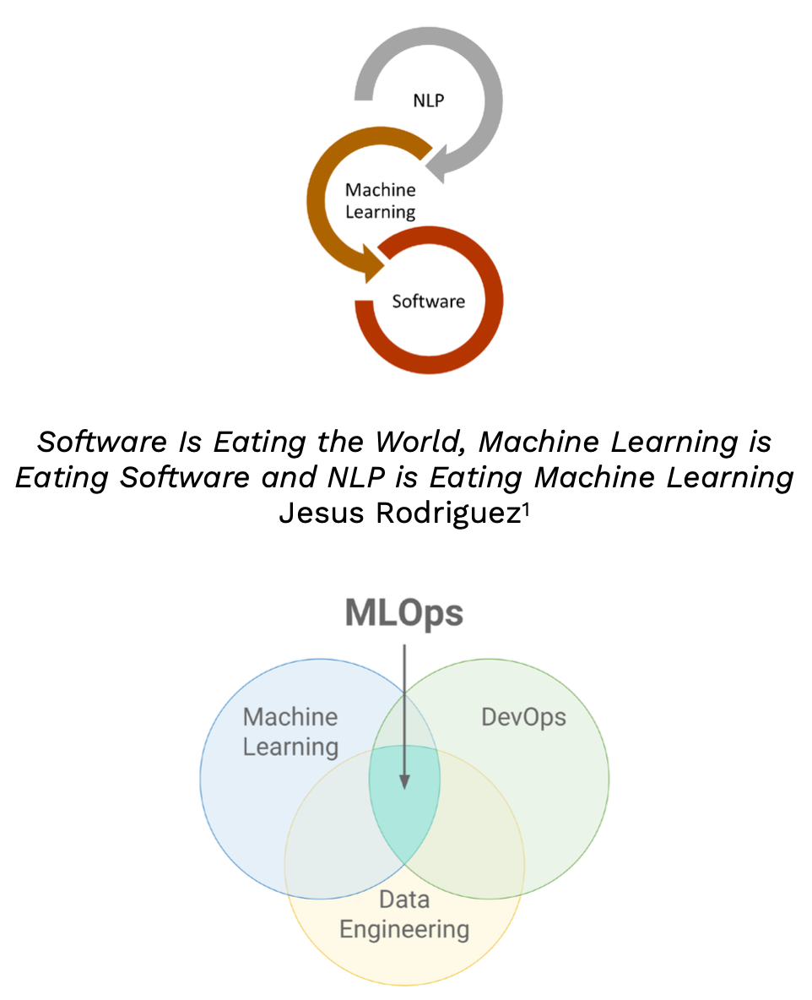
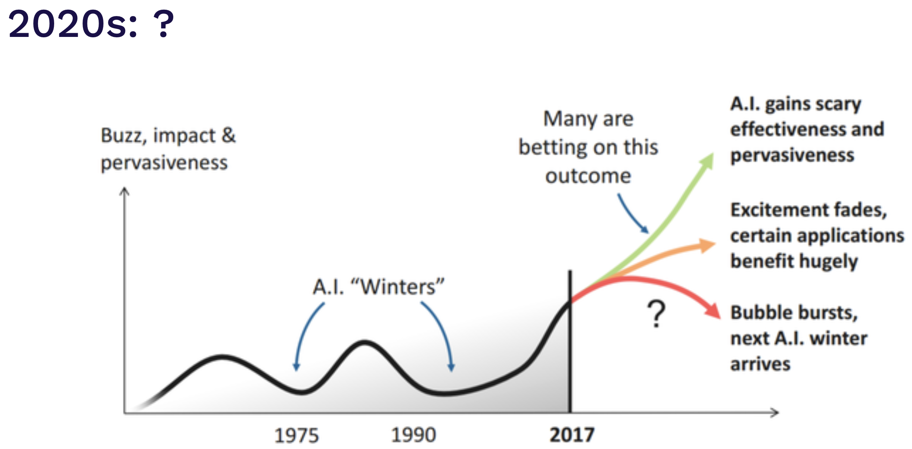
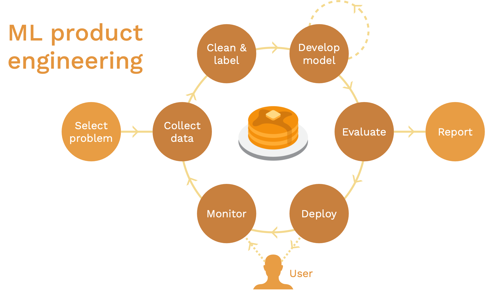
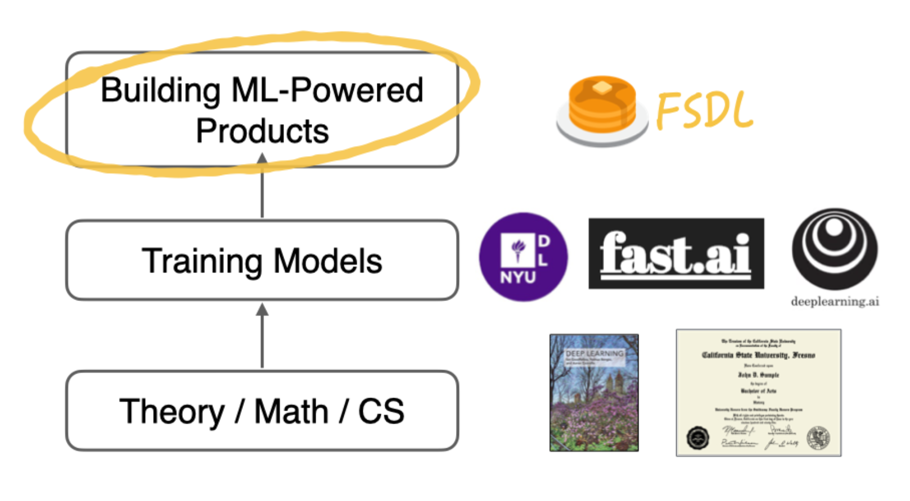
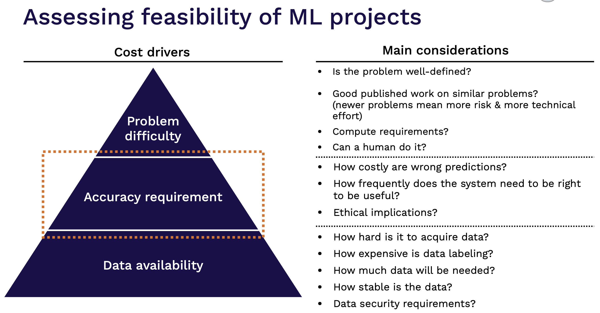

# FSDL, 全栈深度学习 2022
## 01 课程介绍-Josh Tobin
### 课程愿景
1. 机器学习已经成为了当前的主流技术。机器学习和软件之间的关系如下：
2. 2019年之前，我们还会说87%的data science project完成不了产品化，但是2022年已经发生了巨大的变化，为什么？因为模型训练已经产品化了。
3. 根据AI寒冬的发展周期，预测2020s会是如下：
4. 我们把科研成果转化了现实世界中的产品，阻止了AI寒冬的来临。
5. ML-powered，机器学习驱动的产品需要不同的进程。
   1. “Flat-earth” ML，扁平化的进程如下:
   2. ML product engneering，机器学习产品的工程，产品化后多了和用户互动，重视用户反馈，加快产品迭代提升：

6. 本课程的定位不是理论知识，不是模型训练，而是真正建立机器学习驱动的工业产品：
7. 我们的目标包括：
   1. 培养通才技能和对ML驱动产品（以及更普遍的ML项目）组件的理解;
   2. 传授你足够的MLOps来完成任务；
   3. 分享一些最佳项目实践并解释其背后的动机；
   4. 学习一些可能对您进行ML工程师工作面试有帮助的事情；
   5. 形成一个共同学习和相互学习的社区。

8. 我们的目标不包括：
   1. Teach you ML or SWE from scratch
   2. Cover the whole breadth of deep learning techniques 
   3. Make you an expert in any single aspect of ML
   4. Do research in deep learning
   5. Cover the full spectrum of MLOps

9. 巩固你的知识：
   1.  ML
       1.  Andrew Ng: https://www.coursera.org/collections/machine-learning
       2.  Google ML: https://developers.google.com/machine-learning/crash-course
   2.  Software
       1.  The Missing Semester: https://missing.csail.mit.edu/

10. ML驱动的产品和MLOps:
11. 关于我们
12. 我们收到号的反馈，所以我们继续推出课程
13. 我们是怎么开发课程的？
    1.  个人经验和学习
    2.  实际公司的面试
    3.  Posts, papers and product demos。

14. 课程结构（logistics）
    1.  讨论discord
    2.  课程作业
    3.  课程实验

15. Labs，课程实验是根据实际落地项目讲解，结构如下：
### 什么时候使用机器学习？
1. 本节关键点
   1. 机器学习引入复杂性
      1. 在你没准备好之前不要做；
      2. 先考虑和榨光其他所有想法的可行性；
      3. 但是：你并不需要一个完美的框架才能开始。
   2. 优先考虑较为灵活且能产生巨大影响的项目。

#### 到底何时使用ML呢？
   3. 大部分的ML项目都是失败的
      1. 据统计，大概87%的ML项目都会失败，但是大概73%的项目是候补的。

1. 为什么呢？
   1. ML还是预研阶段，不要期望100%的成功。
   2. 但是，大多数还是注定失败的.
      1. 技术上不可行或者适用范围不够广。
      2. 永远不要跃跃欲试。
      3. 未清晰的评价标准。
      4. 有效，但是解决的问题很小，不够复杂。

2. 项目的价值一定要超过问题的复杂性。
3. ML会引入更多的复杂性。
   1. 侵蚀系统之间的界限。
   2. 依赖昂贵的数据。
   3. 通常受到系统设计反模式的困扰。
   4. 受制于外部世界的不稳定性。

4. 所以，使用ML之前，你要自问：
   1. 我们准备好了吗？
      1. 我们又产品吗？
      2. 我们是否以合理的方式收集和存储数据？
      3. 我们有适合的人选吗？
   2. 是否一定要使用ML解决问题呢？
      1. 这个问题需要解决吗？
      2. 我们是否尝试过使用规则或简单的统计数据？
   3. 合乎道德吗？
      1. 要符合伦理！

#### 如何选择要用ML解决的问题？
1. 高回报，低成本。
   1. 影响广泛的问题通常是解决：
      1. 产品中的独特性。
      2. 流程中复杂部分。
      3. 简单预测的地方。
      4. 友商正在做的。

2. 低成本项目是那些有可用数据的项目，而且糟糕的预测并没有太大的危害。
3. 通用的优先框架如下：
4. 高回报的心智模型。
   1. 可以利用便宜预测的地方。
   2. 可以令到你产品独特的地方。
   3. 可以自动化复杂的手动流程的地方。
   4. 其他人在做什么？

5. ML在哪些经济上可行？
   1. AI能减低成本
   2. 预测是决策的核心
   3. 便宜的预测意味着：
      1. 预测无处不在
      2. 即使之前是昂贵的（例如，请一个司机）

    4. 影响：寻找廉价预测将产生巨大业务影响的项目

6. 你的产品需要什么？
   1. Discover Weekly在每个星期一早上直接删除了推送中的不和谐，而不是直接打包音乐推送给用户。
7. ML擅长的是什么？
8. 其他人在做什么？ 
   1. google，amazon，Facebook等在发论文
   2. 早期头部公司在发博客，如Uber, shotify

9. 定义和评估ML项目 
10. 为什么准确率的需求那么重要？因为和成本成正比：

### 生命周期
